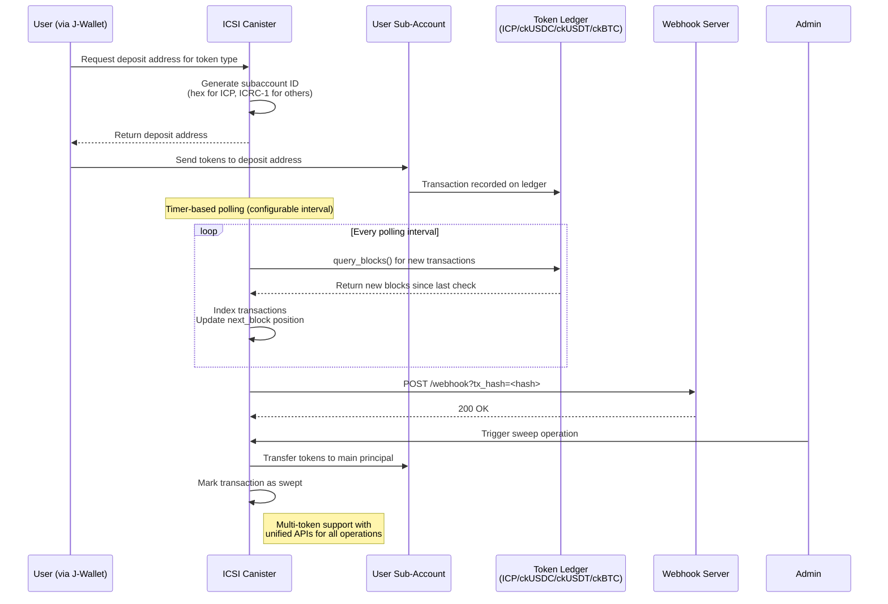

# 🧑‍🚀 ICSI: ICP Sub-Account Indexer

Streamline the management and indexing of principal sub-accounts for ICRC transactions.

[](https://github.com/garudaidr/icp-subaccount-indexer/actions/workflows/build-and-test.yml)

## Overview

ICSI (ICP Sub-Account Indexer) is a robust solution designed to streamline the management and indexing of sub-accounts within the ICP (Internet Computer Protocol) ecosystem. This project aims to enhance the efficiency, security, and scalability of handling multiple sub-accounts under a single principal, making it easier for users and administrators to manage their ICP assets.

The ICSI canister provides methods that allow organizations to primarily carry out several operations:

- Generate sub-account-ids supporting both formats:
  - **ICP**: Traditional hex_string AccountIdentifier format
  - **ckUSDC/ckUSDT/ckBTC**: ICRC-1 textual format (e.g., `canister-id-checksum.index`)
- Track incoming token transfers (ICP, ckUSDC, ckUSDT, ckBTC) into created sub-account-ids
- Manage multi-token balances across all sub-accounts
- Send webhook notifications for incoming deposits (transaction hash as query parameter)
- Sweep tokens from sub-accounts to main principal

### Video Demo

If you are interested in learning more from the builders of ICSI, you can watch the product pitch and presentation in the attached videos below:

- [Jagad ICSI - Product Pitch](https://youtu.be/dxknHHXws-w)
- [Jagad Presentation in ICP Office Hour - Stephen Antoni](https://youtu.be/uwZGl-OaPNI)
- [Jagad App Short Product Demo](https://youtu.be/mMKuJmFbFAY)

## Description

### 1. Simplicity

ICSI simplifies the process of managing sub-accounts by providing a clear and intuitive interface for creating, tracking, and managing sub-accounts. Users can easily generate new sub-accounts and view transaction histories without dealing with the underlying complexities.

### 2. Security

Security is paramount in ICSI. By leveraging the ICP's robust security features and integrating additional validation mechanisms, ICSI ensures that all transactions are secure and compliant with best practices. Features like illicit transaction detection and refund capabilities add extra layers of protection for users' assets.

### 3. Scalability

ICSI is built to scale. With efficient indexing and transaction handling, the system can manage tens of thousands of sub-accounts without compromising performance. The design ensures that querying and managing transactions remains fast and reliable, even as the number of users grows.

### 4. Sequence Flow



## How It Works

### 1. Subaccount Derivation

ICSI uses a [sophisticated mechanism to derive sub-accounts](./docs/SUBACCOUNT_DERIVATION_MECHANISM.md) from a single principal ID. Each sub-account is generated using a combination of the principal ID and a subaccount number, ensuring privacy and uniqueness. This allows for an infinite number of sub-accounts under one principal.

### 2. Transaction Management

Transactions are tracked and managed efficiently. ICSI can list, clear, and refund transactions across sub-accounts, ensuring that all financial activities are transparent and manageable.

### 3. Sweeping Mechanism

ICSI incorporates a [sweeping mechanism](./docs/SWEEPING_SUBACCOUNTS_TO_USERVAULT_MAIN_PRINCIPAL.md) to centralize funds from sub-accounts to a main principal account. This process involves validating transactions and ensuring that only legitimate deposits are swept to the main account.

## Technical Specifications

ICSI is built with a focus on modularity and extensibility. The core components include:

- **Subaccount Management**: Efficient handling of subaccount creation and indexing.
- **Transaction Handling**: Robust mechanisms for listing, clearing, and refunding transactions.
- **Security Features**: Integration with third-party services for transaction validation and illicit activity detection.

## Canister Methods

The canister provides several methods to assist with multi-token deposit management. The complete methods can be observed inside
[Candid File](./src/icp_subaccount_indexer/icp_subaccount_indexer.did)

### Core Methods

```candid
// Generate deposit addresses
add_subaccount : (opt TokenType) -> (variant { Ok : text; Err : Error });
generate_icp_deposit_address : (nat32) -> (text);
generate_icrc1_deposit_address : (TokenType, nat32) -> (text);

// Token operations
sweep : (TokenType) -> (variant { Ok : vec text; Err : Error });
single_sweep : (TokenType, text) -> (variant { Ok : vec text; Err : Error });
sweep_all : (TokenType) -> (variant { Ok : vec text; Err : Error });

// Balance queries
get_balance : (TokenType) -> (nat);

// Transaction management
get_transactions_count : () -> (nat64);
list_transactions : (opt nat64) -> (vec Transaction);
get_transaction : (text) -> (opt Transaction);
```

### Address Format Examples

- **ICP**: `bd54f8b5e0fe4c6b8c6b8c6b8c6b8c6b8c6b8c6b8c6b8c6b8c6b8c6b8c6b8c6b` (hex)
- **ckUSDC**: `y3hne-ryaaa-aaaag-aucea-cai-dzfvpaa.5` (ICRC-1 textual)
- **ckUSDT**: `y3hne-ryaaa-aaaag-aucea-cai-2jmuz5q.10` (ICRC-1 textual)
- **ckBTC**: `y3hne-ryaaa-aaaag-aucea-cai-3xur6ta.15` (ICRC-1 textual)

### Supported Token Types

```candid
type TokenType = variant { ICP; CKUSDC; CKUSDT; CKBTC };
```

The canister automatically registers all four token types during initialization:

- **ICP**: `ryjl3-tyaaa-aaaaa-aaaba-cai` (Native ICP ledger)
- **ckUSDC**: `xevnm-gaaaa-aaaar-qafnq-cai` (Chain-key USDC)
- **ckUSDT**: `cngnf-vqaaa-aaaar-qag4q-cai` (Chain-key USDT)
- **ckBTC**: `mxzaz-hqaaa-aaaar-qaada-cai` (Chain-key Bitcoin)

### Webhook Configuration

```candid
set_webhook_url : (text) -> ();
get_webhook_url : () -> (opt text);
```

Webhooks send POST requests with transaction hash as query parameter:

```
POST https://your-webhook.com/endpoint?tx_hash=<transaction_hash>
```

## Project Structure

This is a pnpm workspace monorepo containing:

- **Root**: DFX canister configuration, deployment scripts, and build tools
- **src/icp_subaccount_indexer/**: Rust canister implementation
- **packages/icsi-lib/**: TypeScript SDK for canister interaction
  - `/src`: Library source code
  - `/test/scripts`: Modern test suite (shell and TypeScript)
  - `/test/scripts/legacy`: Deprecated test scripts
- **scripts/**: Production deployment scripts
- **.maintain/**: Maintenance scripts and tools
- **docs/logs/**: Detailed testing logs and procedures

See [WORKSPACE.md](./WORKSPACE.md) for detailed monorepo documentation.

## Canister Environment Configuration

The project maintains four separate `canister_ids.json` files, each serving different deployment environments:

### 1. `canister_ids.json` (Current Production)

- **Canister ID**: `qvn3w-rqaaa-aaaam-qd4kq-cai`
- **Environment**: Production mainnet
- **Controller**: NEW_MAINNET_CUSTODIAN identity
- **Purpose**: Active production deployment for live operations
- **Usage**: Default file used by deployment scripts for mainnet deployments

### 2. `test_canister_ids.json` (Shared Staging)

- **Canister ID**: `uiz2m-baaaa-aaaal-qjbxq-cai`
- **Environment**: Shared staging/testnet
- **Controller**: STAGING_DEPLOYER identity (for upgrades), testnet_custodian (for operations)
- **Purpose**: Team-shared environment for final testing before production
- **Usage**: Used for coordinated testing and validation workflows

### 3. `devnet_canister_ids.json` (Individual Development)

- **Canister ID**: `y3hne-ryaaa-aaaag-aucea-cai`
- **Environment**: Individual developer environment
- **Controller**: default identity
- **Purpose**: Personal development, debugging, and experimentation
- **Usage**: Individual developer testing without affecting shared environments

### 4. `old_mainnet_canister_ids.json` (Legacy Archive)

- **Canister ID**: `g5nrt-myaaa-aaaap-qhluq-cai`
- **Environment**: Previous production deployment (archived)
- **Status**: Historical reference only
- **Purpose**: Backup reference for migration and historical data
- **Usage**: Not actively used, maintained for reference

### Environment Selection Strategy

The deployment and testing scripts automatically select the appropriate configuration:

- **Production deployments**: Use `canister_ids.json` (current production)
- **Team testing**: Use `test_canister_ids.json` (shared staging)
- **Development work**: Use `devnet_canister_ids.json` (individual environment)
- **Legacy reference**: Use `old_mainnet_canister_ids.json` (archived)

### Independent Environment State

Each environment maintains completely independent:

- **Token balances**: ICP, ckUSDC, ckUSDT, ckBTC balances are separate
- **Transaction history**: No shared transaction data between environments
- **Block processing positions**: Each environment tracks its own `next_block` positions
- **Webhook configurations**: Separate webhook URLs and settings
- **Access control**: Different controller and custodian principals
- **Cycle balances**: Independent cycle management per environment

### Environment Switching

To work with a specific environment, copy the appropriate file:

```bash
# Switch to staging environment
cp test_canister_ids.json canister_ids.json

# Switch to development environment
cp devnet_canister_ids.json canister_ids.json

# Switch back to production
cp old_mainnet_canister_ids.json canister_ids.json  # If needed for reference
# Production uses the default canister_ids.json
```

**⚠️ Important**: Always verify which environment you're working with before making changes, especially when dealing with production funds or testing.

For detailed debugging and management procedures for each environment, see:

- [Canister Debugging Guide](./docs/CANISTER_DEBUGGING_GUIDE.md)
- [Testing Guide](./docs/TESTING_GUIDE.md)

## Usage

### Quick Start

1. **Prerequisites**

   - Install [DFX](https://internetcomputer.org/docs/current/developer-docs/getting-started/install/)
   - Install Node.js and pnpm (`npm install -g pnpm`)
   - Have ICP tokens for mainnet deployment

2. **Local Development**

   ```bash
   # Install all dependencies (monorepo)
   pnpm install

   # Start local replica with old metering (required for ICP ledger)
   pnpm run start:local:env

   # Deploy locally with ICP ledger
   pnpm run deploy:local
   # OR use the deployment script directly
   .maintain/deploy.sh --network local [--clean]

   # Generate test wallet for testing
   pnpm run lib:generate:wallet
   ```

3. **Mainnet Deployment**

   ```bash
   # Deploy to mainnet
   ./scripts/deploy-mainnet.sh deploy

   # Upgrade existing canister
   ./scripts/deploy-mainnet.sh upgrade
   ```

### Deployment

#### Local Development

For local development with ICP ledger:

```bash
.maintain/deploy.sh --network local [--clean]
```

#### Mainnet Deployment

**Option A: Using Deployment Script (Recommended)**

```bash
./scripts/deploy-mainnet.sh deploy  # Initial deployment
./scripts/deploy-mainnet.sh upgrade # Upgrade existing
```

**Option B: Manual Deployment**

1. **Create Internet Identity & Fund Wallet**

   - Get Internet Identity at [identity.ic0.app](https://identity.ic0.app/)
   - Login to [NNS Dapp](https://nns.ic0.app/) and add ~2.0 ICP tokens

2. **Setup Local Identity**

   ```bash
   # Create new identity
   dfx identity new custodian_name
   dfx identity use custodian_name

   # Get and save your principal
   export CUSTODIAN_PRINCIPAL=$(dfx identity get-principal)
   echo "Principal: $CUSTODIAN_PRINCIPAL"
   ```

3. **Create Canister via NNS Dashboard**

   - Create new canister in NNS with sufficient cycles
   - Add your principal as controller
   - Save the canister ID

4. **Deploy Canister**

   ```bash
   # Add canister ID to canister_ids.json
   echo '{"icp_subaccount_indexer": {"ic": "your-canister-id"}}' > canister_ids.json

   # Convert ICP to cycles
   dfx cycles convert 0.3 --network ic

   # Deploy with your principal (replace with actual value)
   dfx deploy icp_subaccount_indexer --network ic --argument '(variant { Mainnet }, 5: nat64, 0: nat32, "ryjl3-tyaaa-aaaaa-aaaba-cai", "YOUR-PRINCIPAL-HERE")'
   ```

#### Post-Deployment Configuration

After deployment, configure the multi-token block positions:

```bash
# Replace <CANISTER_ID> with your actual canister ID

# 1. Verify tokens are registered (should show ICP, CKUSDC, CKUSDT, CKBTC)
dfx canister call <CANISTER_ID> get_registered_tokens --network ic

# 2. Set correct mainnet block positions for each token
# ICP - use a recent block number
dfx canister call <CANISTER_ID> set_token_next_block_update '(variant { ICP }, 25288400 : nat64)' --network ic
# CKUSDC - current block ~391,355 (as of July 2025)
dfx canister call <CANISTER_ID> set_token_next_block_update '(variant { CKUSDC }, 391300 : nat64)' --network ic
# CKUSDT - current block ~524,113 (as of July 2025)
dfx canister call <CANISTER_ID> set_token_next_block_update '(variant { CKUSDT }, 524100 : nat64)' --network ic
# CKBTC - current block ~150,000 (as of July 2025)
dfx canister call <CANISTER_ID> set_token_next_block_update '(variant { CKBTC }, 150000 : nat64)' --network ic

# 3. Set polling interval
# For normal production use (balanced)
dfx canister call <CANISTER_ID> set_interval '(60 : nat64)' --network ic
# For maximum cycle conservation
dfx canister call <CANISTER_ID> set_interval '(500 : nat64)' --network ic

# 4. Verify block positions were set correctly
dfx canister call <CANISTER_ID> get_token_next_block_query '(variant { CKUSDC })' --network ic
dfx canister call <CANISTER_ID> get_token_next_block_query '(variant { CKUSDT })' --network ic
dfx canister call <CANISTER_ID> get_token_next_block_query '(variant { CKBTC })' --network ic
```

**Important Notes:**

- Large WASM files (1.9MB) need ~500B cycles for deployment
- Each token ledger has independent block numbering
- CKUSDC/CKUSDT/CKBTC blocks are much lower than ICP blocks
- Start blocks ~50-100 before current to catch recent transactions
- Polling intervals: 60s for normal use, 500s for maximum cycle conservation

### Testing

#### Quick Testing Guide

The project includes a comprehensive test suite for multi-token deposits and webhook functionality:

```bash
# From root directory (recommended)
pnpm install  # Install all workspace dependencies

# Step 1: Generate test wallet
pnpm run lib:generate:wallet
# Fund the wallet with test tokens (see TESTING_GUIDE.md)

# Step 2: Start webhook server (keep running in separate terminal)
pnpm run lib:test:webhook

# Step 3: Run deposit tests (in new terminal)
pnpm run lib:test:icp    # Test ICP deposits (0.001 ICP)
pnpm run lib:test:usdc   # Test ckUSDC deposits (0.1 ckUSDC)
pnpm run lib:test:usdt   # Test ckUSDT deposits (0.1 ckUSDT)
```

**Key Testing Features:**

- **Multi-token support**: Test ICP, ckUSDC, ckUSDT, and ckBTC deposits
- **Automated webhook testing**: ngrok integration for local webhook testing
- **ICRC-1 compliance**: Proper handling of ICRC-1 textual addresses
- **Production-ready**: Follows actual mainnet testing procedures
- **Comprehensive logging**: All tests documented in `docs/logs/`

**Important Testing Notes:**

1. **Mainnet testing costs real money** - Each test uses actual tokens
2. **Webhook server must stay running** - Keep the webhook terminal open
3. **Transaction indexing takes time** - Wait 30-45 seconds for detection
4. **Use test wallets only** - Never use personal wallets for testing

See [Testing Guide](./docs/TESTING_GUIDE.md) for complete documentation including:

- Manual DFX commands for advanced testing
- Troubleshooting common errors
- Production deployment procedures
- Detailed test logs and lessons learned

#### Test Scripts Architecture

**Modern Scripts** (`packages/icsi-lib/test/scripts/`):

- Shell scripts for complete deposit workflows
- TypeScript webhook server with ngrok integration
- Automated test wallet generation

**Legacy Scripts** (`packages/icsi-lib/test/scripts/legacy/`):

- Manual token operations (deprecated)
- Use modern test suite instead

See [Testing Guide](./docs/TESTING_GUIDE.md#test-script-architecture) for details.

## Essential Canister Management Commands

### Quick Health Check

```bash
# Set canister ID for easier usage
CANISTER_ID="your-canister-id-here"

# Check canister status and cycles
dfx canister status $CANISTER_ID --network ic

# Check current settings
dfx canister call $CANISTER_ID get_interval --network ic
dfx canister call $CANISTER_ID get_registered_tokens --network ic
dfx canister call $CANISTER_ID get_next_block --network ic
```

### Transaction Monitoring

```bash
# Get transaction count
dfx canister call $CANISTER_ID get_transactions_count --network ic

# List recent transactions
dfx canister call $CANISTER_ID list_transactions '(opt 10)' --network ic

# Check token balances
dfx canister call $CANISTER_ID get_balance '(variant { ICP })' --network ic
dfx canister call $CANISTER_ID get_balance '(variant { CKUSDC })' --network ic
dfx canister call $CANISTER_ID get_balance '(variant { CKUSDT })' --network ic
dfx canister call $CANISTER_ID get_balance '(variant { CKBTC })' --network ic
```

### Subaccount Management

```bash
# Generate new subaccount
dfx canister call $CANISTER_ID add_subaccount '(opt variant { CKUSDC })' --network ic

# Generate specific format addresses
dfx canister call $CANISTER_ID generate_icp_deposit_address '(123456789 : nat32)' --network ic
dfx canister call $CANISTER_ID generate_icrc1_deposit_address '(variant { CKUSDC }, 5 : nat32)' --network ic
dfx canister call $CANISTER_ID generate_icrc1_deposit_address '(variant { CKBTC }, 10 : nat32)' --network ic
```

### Configuration Management

```bash
# Set polling interval (seconds)
dfx canister call $CANISTER_ID set_interval '(500 : nat64)' --network ic  # Production
dfx canister call $CANISTER_ID set_interval '(30 : nat64)' --network ic   # Testing

# Set webhook URL
dfx canister call $CANISTER_ID set_webhook_url '("https://your-api.com/webhook")' --network ic

# Update token block positions
dfx canister call $CANISTER_ID set_token_next_block_update '(variant { CKUSDC }, 391300 : nat64)' --network ic
dfx canister call $CANISTER_ID set_token_next_block_update '(variant { CKBTC }, 150000 : nat64)' --network ic
```

### Troubleshooting Commands

```bash
# Add cycles if running low
dfx canister deposit-cycles 200000000000 $CANISTER_ID --network ic

# Check webhook configuration
dfx canister call $CANISTER_ID get_webhook_url --network ic

# Verify custodian access
dfx canister call $CANISTER_ID get_custodian --network ic
```

For comprehensive debugging procedures, see:

- [Canister Debugging Guide](./docs/CANISTER_DEBUGGING_GUIDE.md) (covers both testnet and devnet)

## Conclusion

ICSI represents a significant advancement in the management of ICP sub-accounts, offering simplicity, security, and scalability. By leveraging advanced indexing and transaction handling techniques, ICSI provides a reliable and user-friendly solution for managing ICP assets.

## Research Documents

The following are some of the research documents during specification design:

- [Subaccount Derivation Mechanism](./docs/SUBACCOUNT_DERIVATION_MECHANISM.md)
- [Sweeping Mechanism](./docs/SWEEPING_SUBACCOUNTS_TO_USERVAULT_MAIN_PRINCIPAL.md)

## License

[MIT](./LICENSE.md) © [Jagad](https://t.me/jagadofficial)
