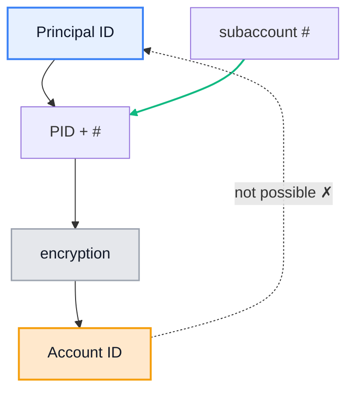
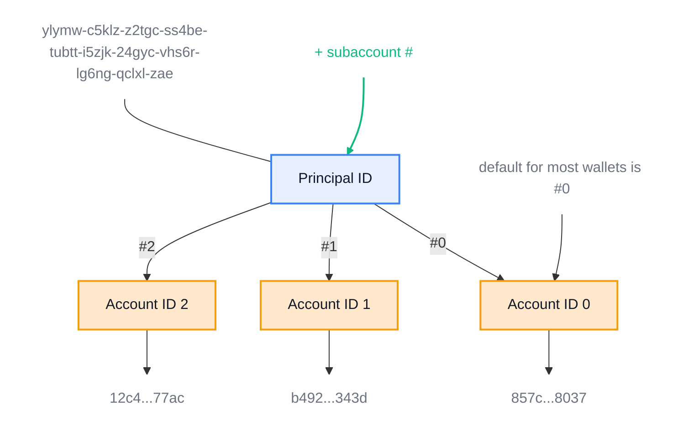

# Subaccount Derivation Mechanism

This document explains the cryptographic mechanism used to derive subaccounts from principal IDs in the Internet Computer Protocol (ICP) ecosystem. It covers the relationship between Principal IDs, Account IDs, and the security implications of the derivation process.

## Table of Contents

- [Definitions](#definitions)
- [Principal ID](#principal-id)
- [Account ID](#account-id)
- [References](#references)
- [Subaccount Derivation Mechanism](#subaccount-derivation-mechanism)
- [Code Breakdown](#code-breakdown)
- [Conclusion](#conclusion)

## Definitions

## Principal ID

The **Principal ID (PID)** is a unique wallet identifier generated for each wallet in the ICP ecosystem. It serves as the fundamental identity for users and canisters.

**Format:** A series of 53 characters separated by hyphens.

```rust
i47b4-sc7bd-bqhxw-ya2ap-jycdi-543vp-l7dpx-32svl-bl7ee-eyjgf-4qe
```

## Account ID

The **Account ID (AID)** is derived from the Principal ID and is used throughout the ICP ecosystem for transaction processing and account management.

**Format:** A series of 64 hexadecimal characters without any separator.

```rust
5d30c908a2c2852ac24d533e0c90fe0932e39992b08106ed77ac036443502b87
```

### Derivation Process

The Account ID is generated by combining the Principal ID and a subaccount number through cryptographic hashing. The subaccount number can be any integer equal to or greater than zero. The combination (PID + subaccount) is processed through **SHA224 hashing** to yield the Account ID.

**Key Security Feature:** The hashing process is designed to be one-way, making it computationally infeasible to reverse-engineer the Principal ID from the Account ID. This adds a layer of privacy to wallet identifiers, as different Account IDs can be generated for different purposes from a single Principal ID.



### Infinite Subaccount Generation

Since any natural number can be used to derive an Account ID from a Principal ID, there can theoretically be an infinite number of Account IDs for one Principal ID. The following diagram illustrates the respective Account IDs for subaccount numbers 0, 1, and 2 derived from a single Principal ID.



## References

### Threads

[https://forum.dfinity.org/t/accountid-to-principal/7564](https://forum.dfinity.org/t/accountid-to-principal/7564)

[https://forum.dfinity.org/t/what-is-the-difference-between-account-identifier-principal-identifier-and-public-key/3677](https://forum.dfinity.org/t/what-is-the-difference-between-account-identifier-principal-identifier-and-public-key/3677)

### Official IC SDK (Rust)

[https://github.com/dfinity-lab/dfinity/blob/master/rs/rosetta-api/canister/src/account_identifier.rs](https://github.com/dfinity-lab/dfinity/blob/master/rs/rosetta-api/canister/src/account_identifier.rs)

## Subaccount Derivation Implementation

The following Rust code demonstrates the technical implementation of the subaccount derivation mechanism:

```rust
use candid::Principal;
use sha2::{Digest, Sha224};

// Default subaccount (all zeros)
const SUB_ACCOUNT_ZERO: Subaccount = Subaccount([0; 32]);
// Domain separator for account derivation
const ACCOUNT_DOMAIN_SEPERATOR: &[u8] = b"\\x0Aaccount-id";

#[derive(Clone, Copy, Hash, Debug, PartialEq, Eq, PartialOrd, Ord)]
pub struct AccountIdentifier {
    pub hash: [u8; 28],  // SHA224 produces 28-byte hash
}

impl AccountIdentifier {
    /// Creates a new AccountIdentifier from a Principal and optional Subaccount
    pub fn new(account: Principal, sub_account: Option<Subaccount>) -> AccountIdentifier {
        let mut hash = Sha224::new();
        hash.update(ACCOUNT_DOMAIN_SEPERATOR);
        hash.update(account.as_slice());

        let sub_account = sub_account.unwrap_or(SUB_ACCOUNT_ZERO);
        hash.update(&sub_account.0[..]);

        AccountIdentifier {
            hash: hash.finalize().into(),
        }
    }
}
```

````

## Code Breakdown

Let's examine each component of the derivation implementation:

### Function Signature

```rust
pub fn new(account: Principal, sub_account: Option<Subaccount>) -> AccountIdentifier
````

This function declaration accepts two arguments:

- `account`: The Principal identifier
- `sub_account`: An optional Subaccount (defaults to zero if not provided)

It returns a new instance of type `AccountIdentifier`.

### Hash Initialization

```rust
let mut hash = Sha224::new();
```

This creates a new instance of the `Sha224` struct, which is a cryptographic hash function that produces a 224-bit (28-byte) hash value. The `new()` function is a constructor that initializes a new instance of SHA224. The `mut` keyword indicates that the hash variable is mutable, allowing it to be updated with data.

### Domain Separator Addition

```rust
hash.update(ACCOUNT_DOMAIN_SEPERATOR);
```

This updates the hash instance with the byte representation of the `ACCOUNT_DOMAIN_SEPERATOR` constant. The domain separator is a byte slice (`b"\\x0Aaccount-id"`) that ensures account derivation is domain-specific and prevents hash collisions with other ICP subsystems. The `update()` method feeds data into the hash function and can be called multiple times to process a stream of data.

### Principal Addition

```rust
hash.update(account.as_slice());
```

This updates the hash instance with the byte representation of the `account` variable. The `account` parameter is an instance of the `Principal` struct from the `candid` crate, representing the principal identifier of an account or canister in the Internet Computer.

**Usage Example:**

```rust
let principal = Principal::from_text("some-principal-id").unwrap();
let account_id = AccountIdentifier::new(principal, None);
```

### Subaccount Handling

```rust
let sub_account = sub_account.unwrap_or(SUB_ACCOUNT_ZERO);
```

This line handles the optional subaccount parameter. If no subaccount is provided (`None`), it defaults to `SUB_ACCOUNT_ZERO` (an array of 32 zero bytes). This ensures every account has a valid subaccount for the derivation process.

### Subaccount Addition

```rust
hash.update(&sub_account.0[..]);
```

This updates the hash instance with the byte representation of the subaccount. The `sub_account` variable is an instance of the `Subaccount` struct, which is a tuple struct containing a single element—an array of 32 bytes. The `.0` syntax accesses the first (and only) element of the tuple struct, and `[..]` creates a slice containing all elements of the array. This conversion is necessary because the `update()` method expects a slice of bytes (`&[u8]`).

### Final Hash Generation

```rust
AccountIdentifier {
    hash: hash.finalize().into(),
}
```

This creates a new instance of the `AccountIdentifier` struct. The `hash` field is assigned the result of `hash.finalize().into()`.

**Process:**

1. `finalize()`: Consumes the hash instance and returns the resulting hash as a fixed-size array
2. `into()`: Converts the hash result into a 28-byte array, which is the required type for the `hash` field
3. The final result is stored in a new `AccountIdentifier` instance

This completes the hash computation and creates the final account identifier.

## Conclusion

### Security Analysis

The primary motivation for this mechanism is to understand whether it's possible to deduce the relationship between a known `account-id` and a known `principal-id` or `seedPhrase` when the `subaccount` is unknown.

### Key Security Properties

1. **One-Way Function**: The hash in `AccountIdentifier` is produced by hashing the `ACCOUNT_DOMAIN_SEPERATOR`, the Principal (account), and the Subaccount together. Even if you know the Principal and the final hash, you cannot confirm that the hash was produced by the Principal without knowing the Subaccount that was used.

2. **Subaccount Format**:

   ```rust
   // Subaccount is 32-bytes format of integer or 64 chars of hexstring
   0000000000000000000000000000000000000000000000000000000000000002
   ```

3. **Cryptographic Irreversibility**: Hash functions like SHA224 are one-way functions. You cannot retrieve the original input data from a hash output. This property makes them useful for verifying data integrity, as even a small change in the input data will produce a drastically different hash, but it also means you cannot reverse-engineer the input data from the hash.

### Seed-Based Verification

If you have the seed that was used to generate the Principal, it could potentially help in verifying the hash in the AccountIdentifier, but only if the Subaccount was also derived from that seed. However, the hash in the AccountIdentifier results from hashing the `ACCOUNT_DOMAIN_SEPERATOR`, the Principal, and the Subaccount together. Therefore, even if you have the seed for the Principal, you would still need to know how the Subaccount was derived to recreate the exact conditions under which the hash was generated.

This design ensures strong privacy and security guarantees for users while maintaining the ability to generate multiple account identifiers from a single principal for different use cases.
