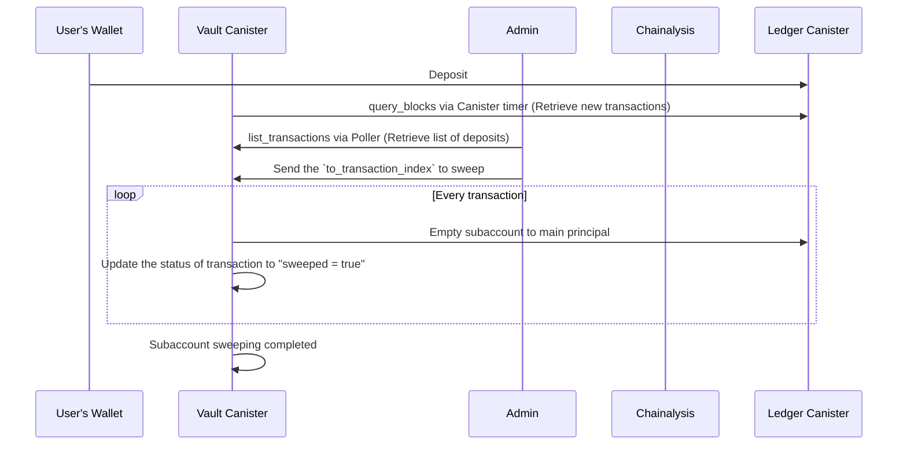
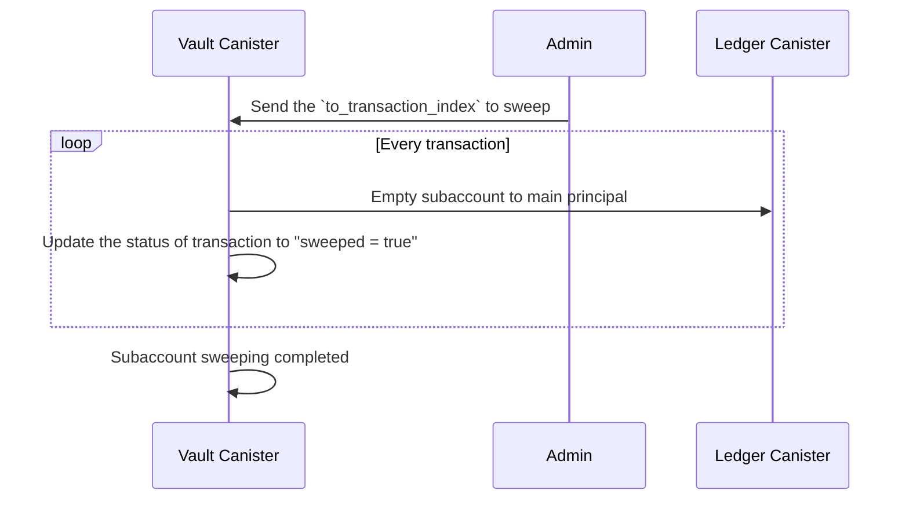

# Sweeping Subaccounts to User Vault's Main Principal

This document describes the subaccount sweeping mechanism in the Internet Computer Protocol (ICP) ecosystem. The system waits until the vault receives a user deposit into one of its subaccounts, then performs validation checks to prevent sweeping deposits from illicit wallets into the main subaccount.

## Background

In the ICP ecosystem, users deposit funds into dedicated subaccounts assigned to them for transactions. After the deposit is confirmed to be clean through validation processes, it is transferred to the main principal of the subaccount—the address of the user vault canister. This consolidation process is called **sweeping**, and it transfers the entirety of the subaccount balance to the main principal.

## User Journey

The following outlines the complete user journey for the subaccount sweeping functionality:

1. **Initial Deposit**: The vault canister receives a deposit from a user's wallet.
2. **Background Validation**: After each deposit, the admin automatically runs background checks using the Chainalysis API by retrieving transactions from the vault canister.
3. **Batch Processing**: The vault canister is designed to process a batch of transactions, starting from the current index and moving up to a specified ending transaction index. To initiate this process, the function accepts a single argument: `to_transaction_index`. This enables batch processing from the first occurrence of `transaction_index` with property `sweeped` == `false` to `transaction_index` == `to_transaction_index`, with sender and receiver address validation.
4. **Fund Transfer**: Finally, the funds are sent to the user vault canister's main principal/wallet. The sweeping process updates all transaction properties `sweeped` to `true` in the `StoredTransaction` type.



## Technical Flow

While this specification expands upon the reasoning behind sweeping a user deposit, it also covers the technical aspects of implementing the sweeping mechanism within an ICP canister.

1. **Batch Transaction Processing**: The vault canister processes transactions in batches, starting from the current index and moving up to a specified ending transaction index. The function accepts a single argument: `to_transaction_index`. This enables batch processing from the first occurrence of `transaction_index` with property `sweeped` == `false` to `transaction_index` == `to_transaction_index`, with sender and receiver address validation.

2. **Fund Consolidation**: The funds are transferred to the user vault canister's main principal/wallet. The sweeping process updates all transaction properties `sweeped` to `true` in the `StoredTransaction` type.



## Data Types

The sweeping mechanism requires a new property in the `StoredTransaction` type—a `boolean` property to track whether the funds contained within the transaction deposit have been swept.

```rust
#[derive(Debug, CandidType, Deserialize, Serialize, Clone)]
pub struct StoredTransactions {
    pub index: u64,
    pub memo: u64,
    pub icrc1_memo: Option<Vec<u8>>,
    pub operation: Option<Operation>,
    pub created_at_time: Timestamp,
    pub sweeped: bool,  // New property to track sweeping status
}
```

## Implementation Approaches

There are two potential approaches for implementing the sweeping function. The following provides a streamlined summary of the discussion on sweeping methods:

### ~~Approach 1: Timer-Based Sweeping~~ (Deprecated)

- **~~Method:~~** ~~Automatic sweeping occurs regularly, e.g., every 4 hours.~~
  - **~~Considerations:~~** ~~Passive, requiring no external trigger.~~
  - ~~Admin must validate transactions before sweeping.~~
  - ~~Capable of consolidating balances from multiple deposits in the same subaccounts.~~
  - ~~Potential for sweeping ICP from all subaccounts to the main vault in a single transaction (to be explored).~~
  - ~~Exposure to ICP volatility due to delayed conversion to IDR.~~

### Approach 2: Admin-Triggered Sweeping (Recommended)

- **Method:** Sweeping is initiated manually by an administrator.
  - **Considerations:**
    - Immediate action reduces exposure to ICP exchange rate volatility
    - May require multiple sweepings for subaccounts with several deposits
    - Increases workload for administrators

**Recommendation:** Approach 2 is suggested as potentially beneficial due to its immediacy and reduced volatility exposure.

### Implementation Details

Regarding the sweeping implementation, we extract only the subaccount IDs from the retrieved `sweep_txs_list`. To ensure no duplicates, we make the list of subaccount IDs distinct. Then, we iterate over this list of unique subaccount IDs to retrieve the balance within each subaccount. This approach allows us to sweep each subaccount once, even if multiple incoming transactions exist.

Transfers are executed using the ICRC-1 transfer function from the designated "payer" account, following the [ICRC-1 transfer standard](https://internetcomputer.org/docs/current/references/icrc1-standard#icrc1_transfer-).

## Conclusion

The subaccount sweeping mechanism for vault canisters is meticulously designed to ensure the integrity and security of transactions within the ICP ecosystem.

By implementing a multi-step verification process that includes manual or automatic admin checks, validation of sender and receiver addresses, and the execution of inter-canister calls, the system effectively mitigates the risk of illicit fund integration.

This sweeping mechanism not only protects the principal assets but also ensures that users' deposits are handled with the utmost care and diligence, reaffirming the reliability and efficiency of ICP's financial operations. The careful orchestration of these steps underscores the commitment to maintaining a secure, transparent, and user-friendly environment for all participants in the network.
